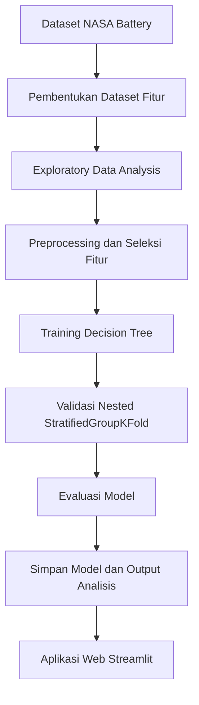
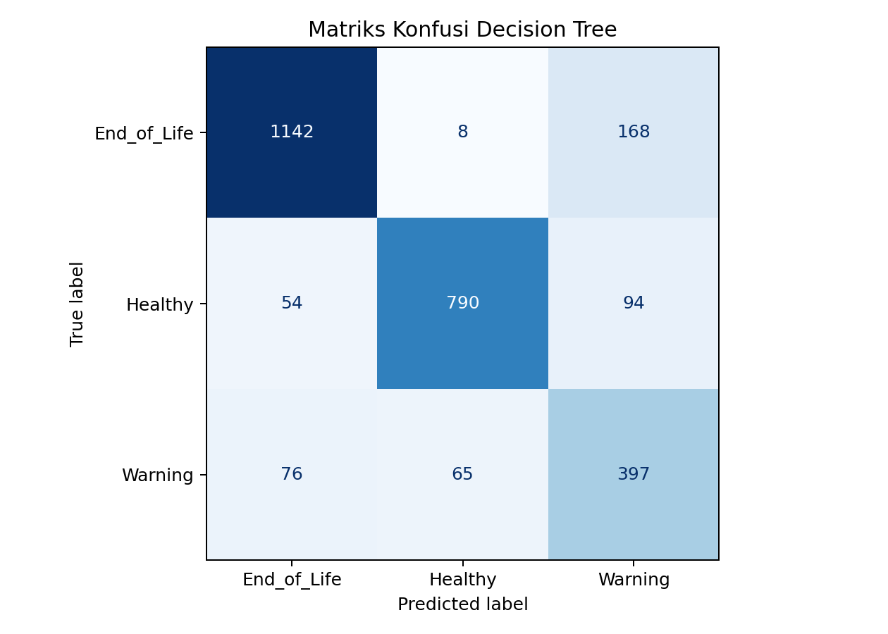
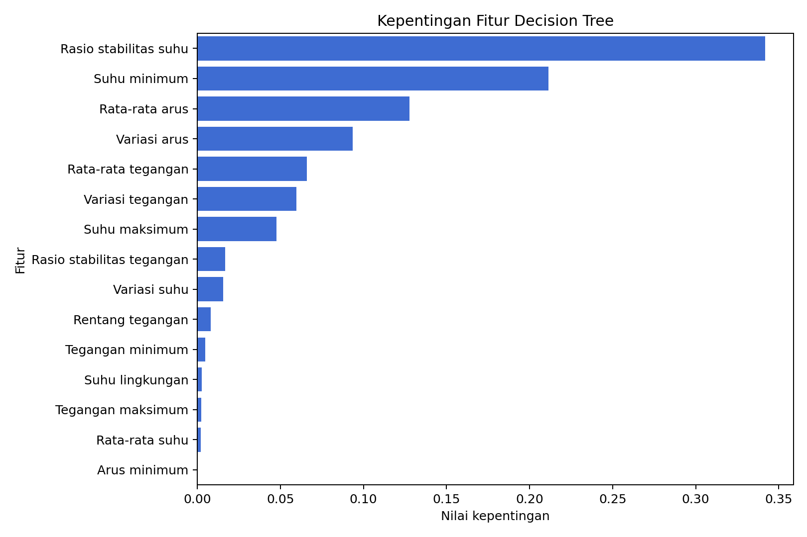
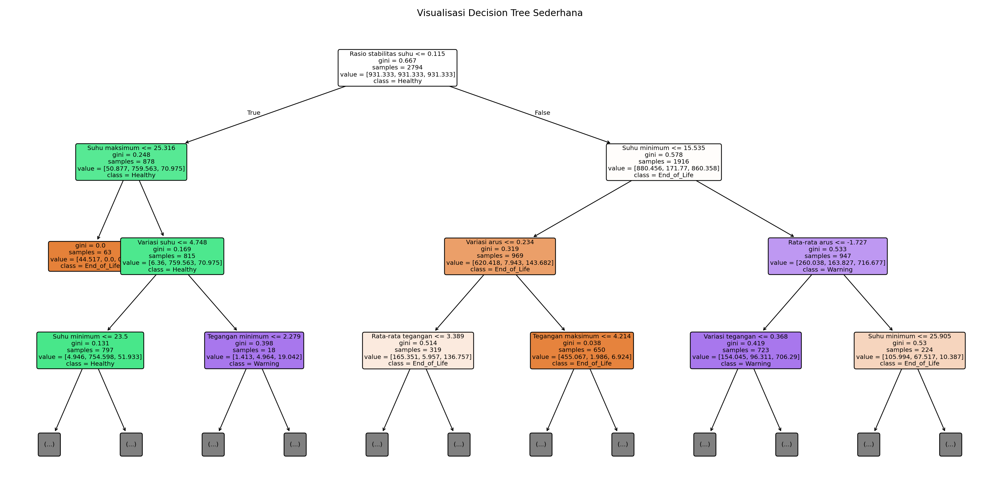

# Battery Health Decision Tree

Proyek ini membangun model klasifikasi kesehatan baterai lithium-ion menggunakan algoritma Decision Tree. Fokus utama proyek adalah menghasilkan model yang mudah dijelaskan, memiliki evaluasi yang dapat dipertanggungjawabkan, dan siap digunakan sebagai dasar aplikasi prediksi berbasis web.

Proyek ini disusun untuk kebutuhan Ujian Tengah Semester mata kuliah Proyek Data Mining.

## Ringkasan Proyek

| Komponen | Keterangan |
| --- | --- |
| Dataset | NASA Battery Data Set |
| Sumber dataset | https://phm-datasets.s3.amazonaws.com/NASA/5.+Battery+Data+Set.zip |
| Model utama | Decision Tree Classifier |
| Target prediksi | `health_status` |
| Jumlah data | 2.794 baris |
| Jumlah baterai | 34 baterai |
| Strategi validasi | Nested StratifiedGroupKFold berdasarkan `battery_id` |
| Aplikasi web | Streamlit |

## Tujuan

Tujuan proyek ini adalah mengklasifikasikan kondisi kesehatan baterai ke dalam tiga kelas:

| Kelas | Definisi |
| --- | --- |
| `Healthy` | SOH lebih besar atau sama dengan 80% |
| `Warning` | SOH berada pada rentang 70% sampai kurang dari 80% |
| `End_of_Life` | SOH kurang dari 70% |

Model tidak menggunakan `capacity_ahr` dan `soh` sebagai fitur prediksi karena kedua kolom tersebut menjadi dasar pembentukan target. Kolom `elapsed_time_sec`, `cycle_index`, dan `discharge_index` juga tidak dipakai untuk mengurangi risiko shortcut prediksi. Dengan cara ini, model diarahkan untuk belajar dari pola sensor, bukan dari informasi yang terlalu dekat dengan label.

## Dataset

Dataset asli berasal dari NASA Battery Data Set yang berisi data penuaan baterai lithium-ion dalam format `.mat`. Data mentah tersebut diolah menjadi dataset tabular yang lebih siap digunakan untuk proses data mining.

File hasil olahan yang digunakan dalam proyek ini:

```text
data/battery_features.csv
```

Dataset hasil olahan berisi fitur statistik dari proses discharge baterai, seperti tegangan, arus, temperatur, durasi, serta informasi identitas baterai. Dataset mentah NASA tidak disimpan di repository agar ukuran proyek tetap ringan.

## Alur Penelitian



## Hasil Evaluasi

Evaluasi dilakukan menggunakan nested StratifiedGroupKFold. Pembagian data mempertimbangkan `battery_id` agar data dari baterai yang sama tidak bocor ke train dan test secara tidak tepat.

| Metrik | Nilai rata-rata |
| --- | ---: |
| Akurasi | 0.8446 |
| F1-score berbobot | 0.8491 |
| Precision berbobot | 0.8712 |
| Recall berbobot | 0.8446 |
| Selisih F1 train-test | 0.0976 |

Parameter terbaik model akhir:

```text
criterion: gini
max_depth: 6
min_samples_leaf: 1
min_samples_split: 5
```

Model menunjukkan performa yang cukup stabil untuk tiga kelas target. Kelas `Warning` menjadi kelas yang paling menantang karena posisinya berada di area transisi antara baterai sehat dan baterai yang sudah mendekati akhir masa pakai.

## Visualisasi Hasil

### Confusion Matrix



### Feature Importance



### Struktur Decision Tree



## Struktur Folder

```text
battery_decision_tree_project/
|-- app.py
|-- train_decision_tree.py
|-- model_components.py
|-- requirements.txt
|-- README.md
|-- draft_laporan.md
|-- notebook_analisis.ipynb
|-- data/
|   `-- battery_features.csv
|-- models/
|   `-- decision_tree_battery.pkl
|-- outputs/
|   |-- 01_eda/
|   |-- 02_preprocessing/
|   |-- 03_modeling/
|   `-- 04_evaluation/
|-- src/
|   `-- build_dataset.py
`-- web/
    |-- index.html
    `-- styles.css
```

## Cara Menjalankan Proyek

### 1. Install dependency

```bash
pip install -r requirements.txt
```

### 2. Membentuk dataset fitur

Jalankan langkah ini jika ingin membangun ulang dataset dari data mentah NASA.

```bash
python src/build_dataset.py
```

### 3. Training dan evaluasi model

```bash
python train_decision_tree.py
```

Output training dan evaluasi akan tersimpan otomatis pada folder:

```text
outputs/
models/
```

### 4. Menjalankan aplikasi web

```bash
streamlit run app.py
```

Web akan menampilkan dashboard ringkasan, visualisasi model, dan form input untuk prediksi kondisi baterai.

## Catatan Implementasi

- Model utama sengaja dibatasi pada Decision Tree agar proses interpretasi lebih jelas.
- Evaluasi memakai pembagian berbasis grup baterai untuk mengurangi risiko evaluasi yang terlalu optimistis.
- Fitur yang terlalu dekat dengan target tidak digunakan dalam training.
- File output disusun per tahap agar mudah dilampirkan ke laporan UTS.
- Aplikasi web dibuat dengan Streamlit dan custom CSS agar tampilan lebih rapi dibanding tampilan standar.

## Lisensi Dataset

Dataset asli dapat diunduh melalui tautan NASA berikut:

```text
https://phm-datasets.s3.amazonaws.com/NASA/5.+Battery+Data+Set.zip
```

Repository ini hanya menyimpan dataset hasil olahan, model, kode program, dan output analisis yang digunakan untuk proyek.
