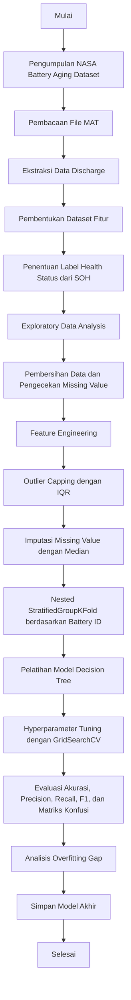

# Draf Laporan UTS Proyek Data Mining

## 1. Judul Proyek Data Mining

**Optimasi Model Decision Tree untuk Klasifikasi Kondisi Kesehatan Baterai Lithium-Ion Berdasarkan NASA Battery Aging Dataset**

Judul ini dipilih karena proyek berfokus pada satu model utama, yaitu Decision Tree. Model digunakan untuk mengklasifikasikan kondisi baterai lithium-ion berdasarkan pola pengukuran saat proses discharge.

## 2. Latar Belakang Penelitian

Baterai lithium-ion banyak digunakan pada perangkat elektronik, kendaraan listrik, perangkat industri, dan sistem penyimpanan energi. Kinerja baterai akan menurun seiring meningkatnya jumlah siklus penggunaan. Penurunan tersebut terlihat dari berkurangnya kapasitas aktual baterai dibandingkan kapasitas nominalnya. Jika kondisi baterai tidak dipantau dengan baik, perangkat yang bergantung pada baterai dapat mengalami penurunan performa, gangguan operasional, dan risiko kerusakan.

Dataset yang digunakan adalah NASA Battery Aging Dataset. Dataset ini berisi data eksperimen baterai lithium-ion melalui proses charge, discharge, dan impedance. Pada proyek ini, data discharge digunakan karena memiliki informasi kapasitas baterai. Kapasitas tersebut digunakan untuk menghitung State of Health (SOH), yaitu perbandingan antara kapasitas aktual dan kapasitas nominal baterai. Berdasarkan nilai SOH, kondisi baterai dikelompokkan menjadi tiga kelas: `Healthy`, `Warning`, dan `End_of_Life`.

Permasalahan utama dalam penelitian ini adalah bagaimana membuat model Decision Tree yang tetap mudah dijelaskan, tetapi tidak terlalu menghafal data. Decision Tree dipilih karena hasilnya dapat dibaca melalui aturan pohon. Kekurangannya, model ini mudah overfitting jika kedalaman pohon tidak dibatasi. Karena itu, penelitian ini memakai validasi berbasis `battery_id`, hyperparameter tuning, dan pengecekan selisih performa data latih dan data uji.

## 3. Diagram Alur Penelitian Fokus Pemodelan

Tahapan penelitian dimulai dari pengumpulan dataset, pembacaan file MATLAB, ekstraksi fitur discharge, EDA, preprocessing, feature engineering, pembagian data berbasis grup baterai, pelatihan Decision Tree, hyperparameter tuning, evaluasi model, dan pemilihan model akhir.



## 4. Kode Program dan Analisa Mendalam

Kode utama berada pada file `train_decision_tree.py`. File tersebut menjalankan seluruh proses pemodelan Decision Tree secara berurutan, mulai dari membaca dataset, EDA, preprocessing, feature engineering, tuning model, evaluasi, hingga penyimpanan model akhir.

### 4.1 Pengambilan Data

Dataset fitur yang digunakan adalah `data/battery_features.csv`, yaitu hasil ekstraksi dari file `.mat` pada NASA Battery Aging Dataset. Setiap baris merepresentasikan satu siklus discharge baterai. Fitur yang digunakan difokuskan pada ringkasan pengukuran sensor, yaitu tegangan, arus, suhu, dan suhu lingkungan.

Kolom `capacity_ahr` dan `soh` tidak digunakan sebagai fitur input karena kedua kolom tersebut berhubungan langsung dengan pembentukan label target. Selain itu, `elapsed_time_sec`, `cycle_index`, dan `discharge_index` juga tidak digunakan agar model tidak terlalu bergantung pada shortcut waktu atau urutan siklus. Dengan strategi ini, model lebih dipaksa membaca pola dari sensor baterai.

```python
df = pd.read_csv(DATA_PATH)
df = df.drop_duplicates()
df = df.dropna(subset=[TARGET, GROUP_COLUMN])

drop_columns = [
    GROUP_COLUMN,
    TARGET,
    "capacity_ahr",
    "soh",
    "elapsed_time_sec",
    "cycle_index",
    "discharge_index",
]
feature_columns = [col for col in df.columns if col not in drop_columns]

X = df[feature_columns]
y = df[TARGET]
groups = df[GROUP_COLUMN]
```

### 4.2 Exploratory Data Analysis

EDA dilakukan untuk memahami karakteristik dataset sebelum model dibuat. Pada tahap ini, `capacity_ahr` dan `soh` boleh dilihat karena keduanya dibutuhkan untuk memahami penurunan kapasitas dan pembentukan label. Namun, kedua kolom tersebut tidak digunakan sebagai fitur saat training model.

Visualisasi yang dibuat adalah:

1. Distribusi kelas `health_status`.
2. Tren penurunan SOH pada beberapa baterai.
3. Heatmap korelasi fitur numerik.

Distribusi kelas penting untuk melihat apakah data seimbang. Tren SOH membantu menunjukkan pola aging baterai, yaitu kondisi baterai cenderung menurun seiring bertambahnya siklus discharge. Heatmap korelasi digunakan untuk melihat fitur yang memiliki hubungan kuat dengan kapasitas atau SOH.

Hasil EDA tersimpan pada:

- `outputs/01_eda/eda_class_distribution.png`
- `outputs/01_eda/eda_soh_trend.png`
- `outputs/01_eda/eda_correlation_heatmap.png`
- `outputs/01_eda/catatan_eda.txt`

### 4.3 Preprocessing dan Feature Engineering

Feature engineering dibuat lebih konservatif agar tidak menghasilkan fitur yang terlalu dekat dengan target. Fitur turunan yang digunakan hanya berasal dari pola tegangan, arus, dan suhu:

- `voltage_range`
- `current_range`
- `temperature_range`
- `voltage_stability_ratio`
- `temperature_stability_ratio`

Fitur seperti `discharge_energy_proxy`, `discharge_power_proxy`, dan `cycle_progress_ratio` tidak digunakan karena dapat membuat model terlalu mudah mengambil shortcut. Fitur yang dipertahankan adalah fitur yang lebih wajar secara domain, seperti rata-rata tegangan, variasi tegangan, rata-rata arus, variasi arus, suhu minimum, suhu maksimum, dan stabilitas suhu.

Ringkasan kelompok fitur:

| Kelompok Fitur | Contoh Fitur | Alasan Penggunaan |
|---|---|---|
| Tegangan | `voltage_mean`, `voltage_min`, `voltage_max`, `voltage_std`, `voltage_range` | Menggambarkan karakteristik tegangan selama proses discharge |
| Arus | `current_mean`, `current_min`, `current_max`, `current_std`, `current_range` | Menggambarkan pola beban dan kestabilan arus |
| Suhu | `temperature_mean`, `temperature_min`, `temperature_max`, `temperature_std`, `temperature_range` | Menggambarkan respons termal baterai selama discharge |
| Stabilitas sensor | `voltage_stability_ratio`, `temperature_stability_ratio` | Mengukur seberapa besar variasi terhadap nilai rata-rata |
| Lingkungan | `ambient_temperature` | Menunjukkan kondisi suhu eksperimen |

Outlier ditangani menggunakan metode IQR capping. Missing value ditangani menggunakan median imputer. Scaling tidak digunakan sebagai tahap utama karena Decision Tree tidak bergantung pada skala fitur seperti model berbasis jarak.

```python
pipeline = Pipeline(
    steps=[
        ("feature_engineering", BatteryFeatureEngineer()),
        ("outlier_capping", IQRClipper(factor=1.5)),
        ("imputer", SimpleImputer(strategy="median")),
        ("model", DecisionTreeClassifier(random_state=42, class_weight="balanced")),
    ]
)
```

### 4.4 Strategi Validasi agar Tidak Overfitting

Validasi menggunakan nested `StratifiedGroupKFold` berdasarkan `battery_id`. Strategi ini lebih aman daripada split acak biasa karena data dari baterai yang sama tidak dicampur antara data latih dan data uji. Dengan demikian, model diuji pada baterai yang berbeda dari data latih, sehingga evaluasinya lebih realistis.

Pada evaluasi ini, setiap fold melakukan hyperparameter tuning pada data latih, kemudian model terbaik fold tersebut diuji pada baterai yang belum pernah dilihat. Semua hasil prediksi data uji dari lima fold digabung menjadi prediksi out-of-fold. Cara ini mengurangi bias karena evaluasi tidak bergantung pada satu pembagian data saja.

```python
outer_cv = StratifiedGroupKFold(n_splits=5, shuffle=True, random_state=42)
inner_cv = StratifiedGroupKFold(n_splits=4, shuffle=True, random_state=42)

for train_idx, test_idx in outer_cv.split(X, y, groups):
    X_train, X_test = X.iloc[train_idx], X.iloc[test_idx]
    y_train, y_test = y.iloc[train_idx], y.iloc[test_idx]
    groups_train = groups.iloc[train_idx]

    grid = GridSearchCV(
        estimator=pipeline,
        param_grid=param_grid,
        scoring="f1_weighted",
        cv=inner_cv,
    )
    grid.fit(X_train, y_train, groups=groups_train)
```

### 4.5 Modelling Decision Tree

Model yang digunakan hanya **Decision Tree**. Hyperparameter tuning dilakukan menggunakan `GridSearchCV` untuk mencari kombinasi parameter terbaik.

Parameter yang diuji:

- `criterion`: `gini`, `entropy`
- `max_depth`: `3`, `4`, `5`, `6`, `7`, `8`
- `min_samples_split`: `2`, `5`, `10`
- `min_samples_leaf`: `1`, `3`, `5`, `10`

```python
param_grid = {
    "model__criterion": ["gini", "entropy"],
    "model__max_depth": [3, 4, 5, 6, 7, 8],
    "model__min_samples_split": [2, 5, 10],
    "model__min_samples_leaf": [1, 3, 5, 10],
}
```

Tuning dilakukan dengan metrik `f1_weighted` karena dataset memiliki tiga kelas dan distribusi kelas tidak sepenuhnya seimbang.

## 5. Hasil Evaluasi Model

Hasil evaluasi akhir tersimpan pada `outputs/04_evaluation/metrics.txt`. Berdasarkan tuning Decision Tree pada seluruh data setelah evaluasi nested cross-validation, parameter model akhir adalah:

```text
criterion: gini
max_depth: 6
min_samples_leaf: 1
min_samples_split: 5
```

Hasil evaluasi utama menggunakan nested group cross-validation:

```text
Akurasi rata-rata per fold: 0.8446 +/- 0.0408
F1-score berbobot rata-rata per fold: 0.8491 +/- 0.0445
Precision berbobot rata-rata per fold: 0.8712 +/- 0.0558
Recall berbobot rata-rata per fold: 0.8446 +/- 0.0408
Selisih F1 train-test rata-rata: 0.0976 +/- 0.0539
```

Hasil tersebut lebih realistis dibanding satu kali train-test split karena seluruh baterai bergantian menjadi data uji. Nilai standar deviasi menunjukkan bahwa performa model dapat berubah antar fold, sehingga evaluasi ini lebih jujur terhadap variasi karakteristik antar baterai.

Laporan klasifikasi out-of-fold:

```text
              precision    recall  f1-score   support

 End_of_Life       0.90      0.87      0.88      1318
     Healthy       0.92      0.84      0.88       938
     Warning       0.60      0.74      0.66       538

    accuracy                           0.83      2794
   macro avg       0.81      0.82      0.81      2794
weighted avg       0.85      0.83      0.84      2794
```

Visualisasi evaluasi tersimpan pada:

- `outputs/03_modeling/fold_evaluation.csv`
- `outputs/03_modeling/decision_tree.png`
- `outputs/03_modeling/decision_tree_rules.txt`
- `outputs/04_evaluation/confusion_matrix.png`
- `outputs/04_evaluation/feature_importance.png`
- `outputs/04_evaluation/feature_importance.csv`

Catatan interpretasi: kelas `Warning` memiliki precision lebih rendah, yaitu 0.60, dan F1-score sebesar 0.66. Kelas ini berada di area transisi, sehingga pola sensornya dapat mirip dengan `Healthy` atau `End_of_Life`. Hasil tersebut menunjukkan bahwa model lebih mudah mengenali kondisi yang sudah jelas, tetapi masih kesulitan pada kondisi peralihan. Ini wajar untuk kasus degradasi baterai karena perubahan kapasitas terjadi bertahap, bukan secara tiba-tiba.

Berdasarkan feature importance, fitur yang paling berpengaruh adalah rasio stabilitas suhu, suhu minimum, rata-rata arus, variasi arus, rata-rata tegangan, dan variasi tegangan. Pola ini masuk akal karena perubahan suhu, arus, dan tegangan selama discharge berkaitan dengan kondisi internal baterai.

## 6. Kesimpulan

Model Decision Tree telah dibuat untuk klasifikasi kondisi kesehatan baterai lithium-ion. Fitur yang digunakan berasal dari ringkasan sensor discharge dan fitur turunan sederhana. Evaluasi dilakukan dengan strategi berbasis `battery_id` untuk mengurangi risiko data leakage dan overfitting.

Model memperoleh F1-score berbobot rata-rata 0.8491 pada nested group cross-validation dan F1-score berbobot out-of-fold sebesar 0.84. Hasil ini lebih realistis karena setiap baterai diuji sebagai data yang belum pernah dilihat oleh model. Model belum sempurna pada kelas `Warning`, tetapi sudah cukup kuat sebagai dasar proyek sebelum masuk ke tahap deployment.
